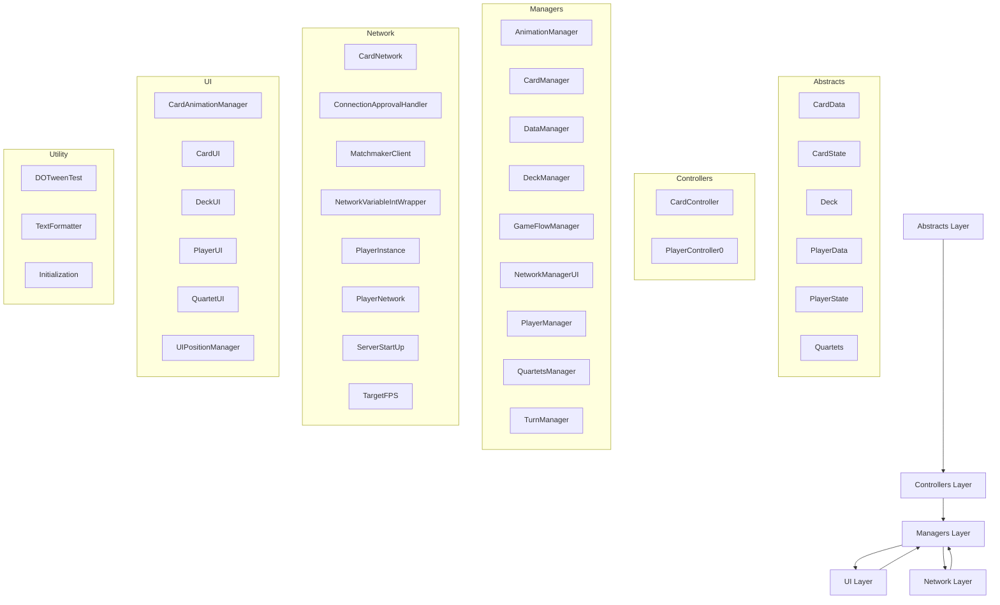

# Architecture Overview

This document describes the high-level architecture of the **Equartets** Unity project.

## Layers and Responsibilities

## Description of Layers

- **Abstracts** → Core game state definitions (cards, deck, players, quartets).
- **Controllers** → Handle direct interactions between data models and managers.
- **Managers** → Coordinate game systems (deck handling, turn flow, animations, etc.).
- **Network** → Multiplayer connectivity using Netcode for GameObjects.
- **UI** → Visual representation and interaction handling for cards, decks, players.
- **Utility** → Helper scripts, formatting tools, and testing utilities.
