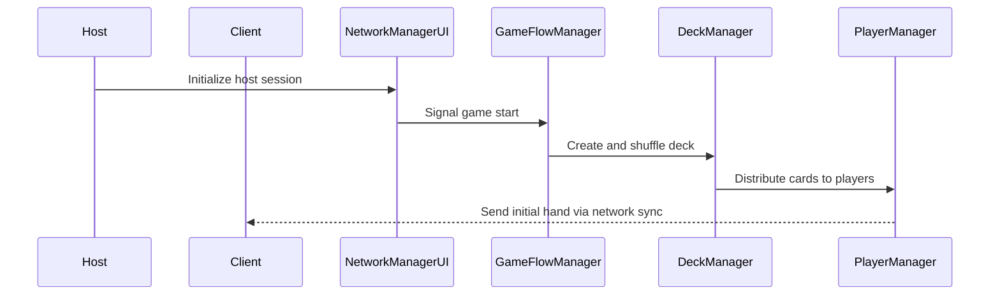
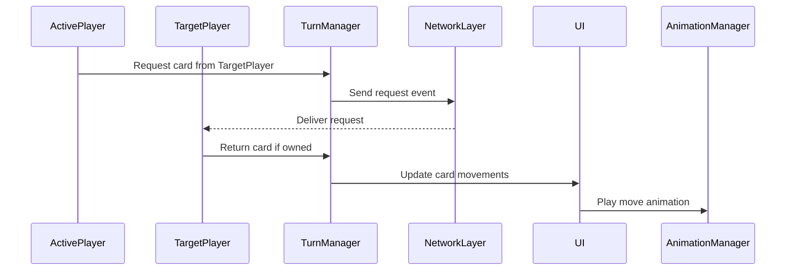
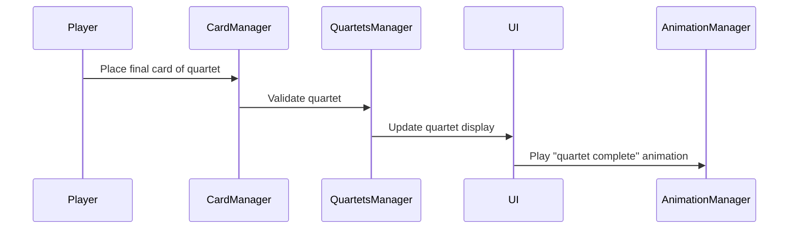

# Data Flow Overview

This document describes how data moves through the **Equartets** Unity project, both locally and across the network.

## 1. Game Start Sequence

---

## 2. Turn Flow (Card Request & Response)

---

## 3. Quartet Completion

---

## Key Principles

- **Managers** handle system-level orchestration (Deck, Game Flow, Turn logic).
- **Network Layer** ensures all game state changes propagate between host and clients.
- **UI Layer** listens to state changes and triggers animations or visual updates.
- **Abstracts** define the immutable data models for cards, decks, and players.

