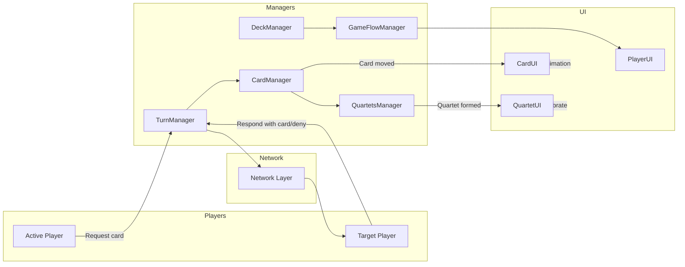

# Visual Data Flow Diagram

This diagram shows the high-level data movement in **Equartets**, from player actions to game state updates and UI changes.

**Legend:**
- **Players**: Local or remote participants
- **UI**: Game visuals and player interaction elements
- **Managers**: Orchestrators of game logic and state
- **Network Layer**: Handles communication between host and clients
